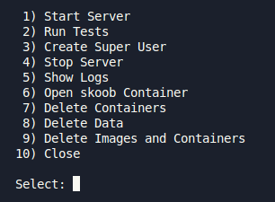

# My Skoob Backend

This is the backend system for my Skoob app, build using Python3 and Django with PostgreSQL.

This application consists of a Restful API for CRUD and user login and CRUD of books and reviews, where any logged in user can add a book and create and modify their own reviews, while admins, in addition to these functions, can also update and validate shared books. Performing validation of business rules and data persistence using Docker and PostgreSQL.

## Models

### User

|      Field      |      Type       | Required |    Default     |
| :-------------: | :-------------: | :------: | :------------: |
|       id        |     number      |   Yes    | Auto Increment |
|      email      |     string      |   Yes    |       -        |
| profile_picture |      image      |   Yes    |       -        |
|     gender      | string: choices |    No    |       -        |
|    birthday     |      Date       |    NO    |       -        |
|    is_staff     |     boolean     |   Yes    |     False      |

### Book

|    Field     |  Type   | Required |    Default     |
| :----------: | :-----: | :------: | :------------: |
|      id      | number  |   Yes    | Auto Increment |
|    title     | string  |   Yes    |       -        |
|   overview   | string  |   Yes    |       -        |
|    author    | string  |   Yes    |       -        |
|    pages     | number  |    No    |       -        |
| release_year | number  |    No    |       -        |
|   validate   | boolean |   yes    |     False      |

### Review

|     Field      |      Type      | Required |    Default     |
| :------------: | :------------: | :------: | :------------: |
|       id       |     number     |   Yes    | Auto Increment |
|      book      |      Book      |   yes    |       -        |
|    book_id     |     number     |   yes    |       -        |
|      user      |      User      |   yes    |       -        |
|    user_id     |     number     |   yes    |       -        |
|     status     | number: choice |   yes    |       3        |
| status_display | string: choice |   yes    |      List      |
|     stars      |     number     |    No    |       -        |
|    comment     |     string     |    No    |       -        |

## :gear: Tools

|  |  |  |
| :----------------------------------------------------------------------------: | :--------------------------------------------------------------------------------------: | :--------------------------------------------------------------------------: |
|                                    Python3                                     |                                        PostgreSQL                                        |                                    Docker                                    |

## Requirements

### Versions

|               Tool               | Version |
| :------------------------------: | :-----: |
|             Python3              | 3.12.3  |
|              Docker              | 28.0.4  |
|          Docker Compose          | 2.34.0  |
| VSCode Black Formatter Extension |  Auto   |

### .env

Follow the <a href="./.env_dev_sample">.env_dev_sample</a> to run the project in dev mode.

### Scripts

It is necessary to allow the execution of scripts <a href="./scripts/dev-menu.sh.sh">dev-menu</a> by running:

```bash
chmod +x ./scripts/dev-menu.sh
```

Now, just run:

```bash
./scripts/dev-menu.sh
```

> some commands will ask for sudo permission

And you will see:



> A set of useful options

## To Do

- Learn more about Permissions and Group Tables to use in this project.
- Update the Login:
  - App for Authentication;
  - SSO;
  - Change default login for JWT or more advanced and temporary token.
- Add documentation for endpoints.

<h6 align="center">by David Propato <a href="https://github.com/Propato">@Propato</a> </h6>
